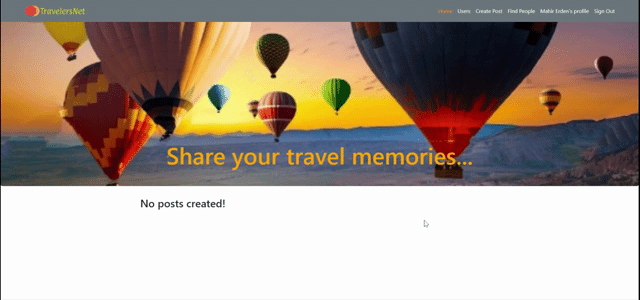
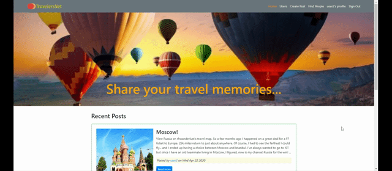

## Final Project: TravelersNet

#### TravelersNet:
TravelersNet is a MERN web application which designed as a traveler social network. Travelers can share their memories and photos with other users. Also users can view and like other users posts and leave comments about their posts.

##### User Story:
Most travelers want to keep their travel memories and photos in a place that can be shared. Also all potential travellers want to get some information about places where they are interested in and planning to visit. 

##### Technologies Used:
...Node and Express server used
...React User interface (UI) library 
...Application backed by MongoDb and Mongoose
...Get and Post routes used for retrieving and adding new data
...Application deployed using Heroku and Mlab
...CSS framework and Bootstrap used for styling
...Followed MVC paradigm
...Used additional npm packages : express, mongoose, jsonwebtoken, express-jwt, cookie-parser, crypto, uuid.

##### Application Workflow:
...Travelers can register and login with their emails and passwords.
...Travelers can share their memories and photos with other travelers.
...Travelers can see other users posts and comments.
...Travelers can leave a comment about other user's posts.
...Travelers can like other user's post.
...Travelers can follow other users.


#### Application Demo








##### Author
Mahir Erden


##### Application Links
```
Heroku : https://arcane-forest-70269.herokuapp.com/
Github : https://github.com/MahirErden/travelersnet
